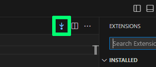

# Tired2Backup

## Opinionated lazy versioning control

Tired2Backup simplifies file backups in VSCode with just a click.

### Features

- Adds a backup button in the top right corner of the editor
- Allows backup via the "Backup!" command

### Settings

Two customizable settings are available:

1. **Initials** (`tired2backup.initials`)
2. **Name of backup folder** (`tired2backup.backup.folder.name`)

### Backup Format

Backups are created in the following formats:

- `[filename][yyyy-mm-dd]-[initials].[ext]`
- `[filename][yyyy-mm-dd]-[initials]_[index].[ext]` (if the file already exists)